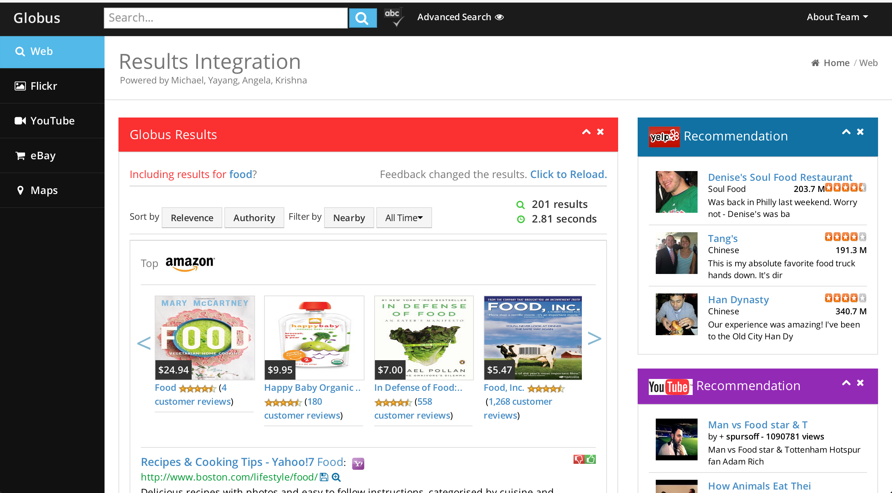

Cloud Computing Search Engine - MiniGoogle
=============================

A Google style web search engine computing Hadoop MapReduce on Amazon EC2 consisting of crawler, indexer, PageRank, and UI.
[Click Here to View Demo. ](http://globus-search.appspot.com)
`Spring 2013`

## _Skills_
    
    Language: Java
    Web: HTML, CSS, Servlet, JSP, jQuery, AJAX
    Cloud: Hadoop, MapReduce, Amazon EC2, FreePastry
    Database: Berkeley DB
    

## _Contribution_
1. Developed a scalable, Google-style crawler that distributed requests across multiple crawling peers over Pastry nodes. 
2. Developed a TF-IDF indexer for inverted index computation and a PageRank engine for link analysis based on MapReduce. 
3. Improved search relevancy by weighting ten ranking parameters, utilizing AJAX feedback and SVM classifier for tuning.
4. Implemented features for fault tolerance with Berkeley DB revert, RESTful web services with Yahoo, Amazon, YouTube, Yelp, Wiki, MaxMind, EBay API.

## _About_
* Course: `CIS 555, Internet & Web Systems, Spring 2013, University of Pennsylvania`
* Teamwork: `Yayang Tian, Michael Collis, Angela Wu, Krishna Choksi`

## 
## _Snapshots_

